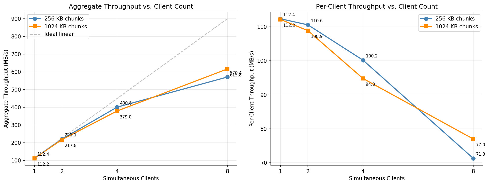

# WireBound — High Performance LAN File Distribution System

## Overview

WireBound is a LAN file distribution system built in C++ that lets a server push a single file to multiple clients simultaneously over TCP. The core idea is straightforward: when you need to send a large file to many machines on the same network, you want the server to read the file as few times as possible and serve all clients from memory. WireBound achieves this through memory-mapped file I/O, which lets the OS page cache absorb the file after the first read so subsequent clients get served entirely from RAM.

The project is split into a server and a client. The server opens a file, maps it into memory, computes its SHA-256 hash and then listens for incoming connections. Each connecting client gets its own thread, and the server streams the file in fixed-size chunks. The client receives the chunks, writes them to disk and feeds them into an incremental hasher, and at the end verifies that the received file matches the server's hash.

---

## Architecture

The codebase is structured around a clean abstraction called `ChunkSource` — a pure abstract interface that represents any source of file chunks. The actual implementation is `MappedChunkSource` which uses Windows memory-mapped file APIs (`CreateFileMapping` and `MapViewOfFile`) to map the file into the process address space. This design means the server code never calls `read()` or `fread()` — it just hands out pointers into the mapped view and the OS handles the actual memory-to-memory copy.

The server is single-threaded for accepting connections but spawns one worker thread per client. All worker threads share the same `MappedChunkSource` object, which is safe because the mapped view is read-only. Console output from all threads is serialized through a global mutex (`g_console_mtx`) defined as an inline variable in `progress_tracker.hpp`.

**Key components:**

| File | Purpose |
|------|---------|
| `include/chunk_source.hpp` | Abstract interface defining `FileMeta`, `ChunkView` and `chunk_count()` |
| `include/mapped_chunk_source.hpp` / `src/server/mapped_chunk_source.cpp` | RAII wrapper around Windows file mapping APIs, non-copyable |
| `include/progress_tracker.hpp` | Per-client atomic progress counters and inline progress printing |
| `include/protocol.h` | Wire types: `FileMetaWire`, `ChunkHeader`, `PacketType` enum |

---

## Wire Protocol

The protocol is a simple binary framing protocol over TCP. The connection starts with a handshake:

1. Server sends a `FileMetaWire` struct containing `total_size` (uint64), `chunk_size` (uint32), `chunk_count` (uint64) and a 64-character SHA-256 hex string
2. Server sends a uint32 filename length followed by the filename bytes
3. Server sends all chunks. Each chunk is prefixed with a `ChunkHeader` containing a type field (`PACKET_CHUNK = 1`), a 0-based chunk index (uint64) and the chunk size in bytes (uint32), followed immediately by the chunk data
4. Server sends a final `ChunkHeader` with type `PACKET_END` to signal completion

Both sides use `sendAll`/`recvAll` loops that keep calling `send`/`recv` until every expected byte is transmitted. This is necessary because TCP is a stream protocol and a single call is not guaranteed to transfer the full requested amount.

Both sides set `TCP_NODELAY` to disable Nagle's algorithm and both use 4 MB send/receive buffers (`SO_SNDBUF`/`SO_RCVBUF`) to avoid stalling on large transfers.

---

## Server Implementation

### Memory-Mapped Serving

The file is opened with `CreateFileA` using `GENERIC_READ` and `FILE_SHARE_READ`, then mapped with `CreateFileMappingA` and `MapViewOfFile`. The mapping covers the entire file (passing offset 0 and size 0 maps the whole file). `get_chunk()` computes a byte offset from the chunk index and returns a `ChunkView` which is a pointer into the mapped view plus a length. The last chunk length is computed as `total_size - offset` rather than `chunk_size` to correctly handle files that are not exact multiples of the chunk size.

### SHA-256 Hashing

The `MappedChunkSource` constructor hashes the entire file using picosha2's streaming hasher (`hash256_one_by_one`) in 16 MB blocks. Progress is printed to console during hashing. The resulting 64-character hex string is stored in `FileMeta` and sent to every client as part of the handshake.

### Multi-Client Threading

The main accept loop runs forever, spawning a `std::thread` for each accepted connection. Each thread gets its own `ClientProgress` struct and calls `serve_client()`. The threads are stored in a `vector<thread>` and joined on shutdown rather than detached — this ensures in-flight transfers complete cleanly before the process exits.

`serve_client()` sends the `FileMetaWire` and filename first, then iterates through all chunks sending each with its `ChunkHeader` prefix, then sends `PACKET_END`. Each iteration updates the `ClientProgress` atomics and calls `print_inline()` which overwrites the current console line.

### Clean Shutdown

A `SetConsoleCtrlHandler` handler catches `CTRL_C_EVENT` and `CTRL_CLOSE_EVENT`. It sets an atomic `g_shutdown` flag and calls `closesocket()` on the listening socket, which causes the blocked `accept()` call to return `INVALID_SOCKET` and break the accept loop. The main thread then joins all worker threads and prints session statistics before exiting. Pressing Ctrl+C never drops an active transfer mid-stream.

### Exception Safety

Each worker thread wraps `serve_client()` in a `try/catch(...)` block. `closesocket()` on the client socket is placed outside the try block so it always runs regardless of whether the transfer succeeded, failed or threw.

### Benchmark Instrumentation

The server tracks several metrics across a session. `IO_COUNTERS` snapshots are taken before and after the session using `GetProcessIoCounters()` — the difference in `ReadOperationCount` tells us how many actual disk reads occurred. If this is zero, the OS served everything from the page cache. `GetProcessMemoryInfo()` reports peak working set size. The session timer starts on the first accepted connection rather than on listen, so the aggregate MB/s reflects actual transfer time. All per-client and session totals use `std::atomic` counters.

### Edge Case Hardening

- `MappedChunkSource` constructor rejects `chunk_size = 0` with `std::invalid_argument` before any division happens
- `MappedChunkSource` constructor rejects zero-byte files with `std::runtime_error`
- `get_chunk()` bounds-checks the index against `chunk_count` and throws `std::out_of_range` if violated, preventing unsigned underflow in the length calculation
- `Server.cpp` wraps the chunk-size-kb CLI argument parse in `try/catch` and explicitly checks for zero after multiplication

---

## Client Implementation

The client connects to the server, receives the handshake (`FileMetaWire` and filename), opens an output file and enters the chunk receive loop. For each iteration it reads a `ChunkHeader`. If the type is `PACKET_END` it breaks. If the type is neither `PACKET_CHUNK` nor `PACKET_END` it reports a protocol error and exits. If `hdr.size` is zero it treats that as a protocol error too. Otherwise it allocates a buffer, calls `recvAll` to fill it, writes it to the output file and feeds it into the incremental picosha2 hasher.

After the loop two post-transfer checks run before hashing:

- If `chunks_received` does not equal `wire.chunk_count`, the transfer is flagged as incomplete
- If `bytes_received` does not equal `wire.total_size`, the transfer is flagged as a size mismatch

Then `hasher.finish()` is called and the computed hash is compared against the expected hash from the handshake. A match prints `PASS`, a mismatch prints `FAIL`.

Progress display uses `printf` with a carriage return so each update overwrites the previous console line. It shows chunk index, percentage, current MB/s and ETA. On server disconnect during transfer the client prints the last completed chunk number so the user knows how far the transfer got.

---

## Benchmark Results

**Setup:** 1 GB zero-filled test file, server and clients on the same machine over loopback (127.0.0.1), chunk sizes of 256 KB and 1024 KB, client counts of 1/2/4/8. All 32 transfers completed with SHA-256 PASS.

| Chunk Size | Clients | Avg Per-Client | Aggregate  |
|------------|---------|----------------|------------|
| 256 KB     | 1       | 112.4 MB/s     | 112.4 MB/s |
| 256 KB     | 2       | 110.6 MB/s     | 221.1 MB/s |
| 256 KB     | 4       | 100.2 MB/s     | 400.8 MB/s |
| 256 KB     | 8       | 71.3 MB/s      | 570.4 MB/s |
| 1024 KB    | 1       | 112.2 MB/s     | 112.2 MB/s |
| 1024 KB    | 2       | 108.9 MB/s     | 217.8 MB/s |
| 1024 KB    | 4       | 94.8 MB/s      | 379.0 MB/s |
| 1024 KB    | 8       | 77.0 MB/s      | 615.8 MB/s |

### Analysis

Single-client throughput of ~112 MB/s sits right at the Gigabit Ethernet ceiling (theoretical max ~125 MB/s) so on a real GigE LAN this would be wire-limited as expected.

Aggregate throughput scales close to linearly up to 4 clients and then starts to flatten at 8. This is expected on a loopback test since all processes share the same CPU and memory bandwidth. On a real network with separate client machines the scaling would likely hold up longer before flattening.

1024 KB chunks pull slightly ahead of 256 KB at 8 clients (615 vs 570 MB/s) because larger chunks mean fewer system calls and less per-chunk overhead when the server is under concurrency pressure.

The server-side design goal of zero disk re-reads after the first client is achieved by the memory-mapped approach. Once the OS page cache warms up on the first transfer, every subsequent client's read is served from RAM. This is confirmed by the `IO_COUNTERS` disk read delta being zero on repeated runs.

The main bottleneck on the client side is picosha2, which is a pure-software SHA-256 with no hardware acceleration. At the speeds observed, hashing is likely the limiting factor rather than the network or TCP stack. On a 10GbE network this would become a visible problem.

---

## Real-Network Results

The sweep above runs on loopback, which is a clean way to study scaling but takes the network out of the picture. To see how WireBound behaves on a real link we added an optional LZ4 compression mode and tested it between two Windows machines on the same 5 GHz Wi-Fi. The server compresses each chunk before sending and the client decompresses it, and because the client still hashes the original bytes the end-to-end SHA-256 check holds exactly as before. Compression is off by default and turned on with a flag, and any chunk that does not actually shrink is sent raw so incompressible data is never penalized. The test file was a 164 MB Windows log that compresses about 12x.

The single-client numbers tell the main story:

| Mode | Per-client throughput |
|------|-----------------------|
| Uncompressed | ~8 MB/s |
| LZ4 | ~118 MB/s |

That is roughly a 14x speedup, in line with the compression ratio. The reason is simple. On loopback the bottleneck was the server and the hashing rather than the link, so compression made no measurable difference there. On Wi-Fi the link is the bottleneck, so sending about 12x fewer bytes translates almost directly into finishing about 12x sooner.

It is worth stressing that this was a 5 GHz Wi-Fi link and not an old 2.4 GHz one, yet the uncompressed rate of about 8 MB/s still reflects the real throughput between these two particular machines rather than any limit in the server. The cap comes from the wireless medium itself, things like the adapter in the weaker machine, the distance from the router and the interference around it. That is the whole takeaway. The server hands bytes to the link as fast as the link will accept them, and on Wi-Fi the link is what gives out first, which is why cutting the bytes with compression buys so much.

The multi-client behavior was even more telling. With two clients connected at once and no compression the Wi-Fi link saturated and the two transfers could not share it evenly. One flow dominated while the other crawled, and only once the first finished did the second speed up, so the transfers were effectively serialized by the link. With compression on each client put only about 13 MB on the wire, the link was no longer saturated, and both clients ran in parallel at much higher rates. This is the clearest demonstration of why compression helps here, and it is also the motivation for the multicast idea in Future Work, since one TCP connection per client means the shared link carries a separate copy for everyone.

Two things held up exactly as designed on real hardware. The server reported zero disk reads across every run, so the page cache served everything after the first read, and peak memory stayed flat at about 185 MB regardless of file size or client count. We also closed a few clients mid-transfer on purpose, and the server logged each dropped client and carried on serving the rest without crashing.

A note on the numbers. The 12x ratio comes from a very repetitive log file. Everyday mixed data compresses more like 2x to 4x, and already-compressed files such as video, images or installers barely compress at all. The relative speedup on a network-bound link scales with whatever ratio the data allows.

---

## Future Work

WireBound works well for its core purpose but there is a lot of room to grow it into something more complete.

- **GUI / Desktop App** — Right now everything is CLI. A proper desktop UI would make the tool accessible to non-technical users. A sender side where you drag and drop a file, see connected clients and their progress bars, and a receiver side where you just enter an IP and watch the download would make WireBound genuinely usable as a product rather than a demo.

- **Resume / Partial Transfer** — If a client disconnects halfway it has to start over. A smarter protocol could let the client advertise which chunks it already has and the server would skip those. This would be especially useful on flaky networks or for very large files.

- **Multicast / Broadcast Mode** — Right now the server opens one TCP connection per client and sends the same data N times. On a LAN, UDP multicast would let the server send each chunk once and have all clients receive it simultaneously. This would make the aggregate throughput truly flat regardless of client count instead of scaling with CPU and NIC bandwidth.

- **Hardware-Accelerated Hashing** — The SHA-256 bottleneck on the client side (picosha2 is pure software) would be solved by switching to a library that uses AES-NI or SHA-NI CPU instructions. On modern hardware this can be 5-10x faster.

- **Cross-Platform Support** — The codebase uses Windows-specific APIs throughout (Winsock2, `CreateFileMapping`, `MapViewOfFile`, `GetProcessIoCounters`). Porting to POSIX (`mmap`, `sendfile`, `epoll`) would let it run on Linux and macOS. The `ChunkSource` abstraction already isolates the platform-specific parts so the port would be mostly contained to `MappedChunkSource` and the socket code.

- **Encryption** — Transfers are currently plaintext. Adding TLS (via mbedTLS or OpenSSL) or a simple symmetric key exchange would make the tool safe to use on networks you don't fully trust.

- **Chunk Verification** — The current design verifies the whole file at the end. Adding per-chunk checksums (even just CRC32) would let the client detect and request retransmission of individual bad chunks rather than failing the entire transfer and starting over.
